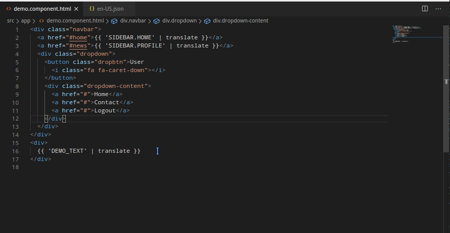

# ngx-translate-utils

This extension should be used with angular translation library [ngx-translate](https://github.com/ngx-translate/core).  


 

[Link to VSCode Marketplace](https://marketplace.visualstudio.com/items?itemName=nikhilgoud.ngx-translate-utils)
This is created using the existing extensions  
[ngx-translate-zombies](https://github.com/seveves/ngx-translate-zombies)  
[resource-peek](https://github.com/Hademar/resource-peek/)  
[ngx-translate-quickcreate](https://github.com/NextFaze/ngx-translate-quickcreate)
 

## Features

- Hover on a translation key to displays values from all language files (normally located in a [language-code].json file). 
- Suggests keys from en.json for autocomplete in both ```HTML``` & ```typescrpt``` files 
- Ctrl+Click on translation keys to go to value/peek at all translation files.

- Open QuickAction (hit F1)

|Command|Description|Fumtion|
|:---|:---|:---|
|```ngxu.createTranslation``` | ```NGX-Translate: Generate Translation code snippet.```|- Turns selected text into a ngx-translate snippet string and pipe. Incase of new key the ```"KEY": "VALUE"``` string is copied to clipboard for [defaultLanguage].json file.|
|```ngxu.zombies``` |```NGX-Translate: Find Unused translations in this file.``` |When having a ngx-translate translation(lang file) file. A diff editor will be openend showing the unused keys.|
|```ngxu.organize``` |```Organize translations in this file with base language file```|When having a ngx-translate translation(lang file) file. Prompts to Save or Open diff editor.|
|```ngxu.missed``` |```Find Missing translations in this file after oraganizing with base```|When having a ngx-translate translation(lang file) file. A diff editor will be openend showing the missed keys.|{:.table-striped}  


## Contribute / Bugs / Feature Requests / Help

#### [Issue/Feature Tracking.](https://github.com/nikhilgoud/ngx-translate-utils/pulls)

## Requirements

Angular project with ngx-translate

## Extension Settings

|Setting|Description|Default value|
|---|---|---|
|```ngx-translate-utils.langFileFolderPath```|Base Location for i18n json files folder|```**/src/assets/i18n/```|  
|```ngx-translate-utils.includeAll```|Consider all language files to lookup|```false```|
|```ngx-translate-utils.defaultLang```|Language file to lookup for autocomplete suggestions example: en, en-US, de, en-IN etc|```en```|
|```ngx-translate-utils.autocapitalize```|Automatically capitalize the translation string key - only applies in snake case mode|```true```|
|```ngx-translate-utils.caseMode```|Type of case to use for translation string - options are 'camel' and 'snake'|```snake```|
|```ngx-translate-utils.replaceOnTranslate```|Replace the selected text after generating a translation string|```true```|
|```ngx-translate-utils.translatePipeName```|The name of the pipe to handle the translation|```translate```|
|```ngx-translate-utils.translatePlaceholder```|The code block to handle the translation in ts files|```this.translateService.instant({key})```|
|```ngx-translate-utils.translateJSONPlaceholder```|The code block to handle the translation in json files|```{key}```|
|```ngx-translate-utils.quote```|Which quote to use around the inserted translation key|```'```|
|```ngx-translate-utils.padding```|Add spaces inside the curly bracket pair|```true```|
|```ngx-translate-utils.promptForOrganize```|Open diff window with changes to do for organizing language File|```true```
|```ngx-translate-utils.ignorePatternForGenerate```|Regex of vals to ignore while generating translation snippet|```\\s?(\\n|<br>|<html>|<\\/html>|\\s)\\s?```|


## Release Notes

## 0.0.1  
Initial features added
- Unused keys from selected language json file in diff window  
- Displays values from all language files  
- Provides keys for autocomplete
- peek all translation files on ctrl+click.

## 0.0.10
- Bug Fixes & Improvements.
- Added vscode settings support.
- Default language support
- convert selected hardcoded text into a ngx-translate string and pipe.

## 0.0.11
- Bug Fixes & Improvements.
- New commands for syncing: 
    - organize: organize keys in selected lang file with base file
    - missed: find missed translations in selected lang file with base file
- Added json file support for generate translation snippet.


